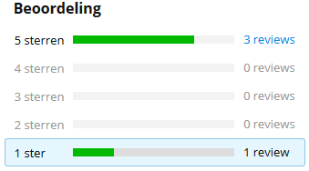

# Project

## Sentiment Analysis
Create a sentiment analysis application in an environment by choice.
The goal of this sentiment analysis is to predict the sentiment of an unseen sentence (positive/negative) 
To achieve this, you've to create your own corpus which contains user reviews by **coolBlue**.

### part 1: webscraping - Corpus
The goal of a corpus is to have a +/- reliable document which contains reviews and their respectively values.
We assume that *low*-scored reviews contain more *negative* words then *highly*-scored scored reviews (and vice versa).
Therefor the first task is to scrape positive and negative articles from **coolBlue**

 - Positive = 4 & 5 stars
 - Negative = 1 & 2 stars
 - Ignore 3 star reviews
 
#### Start - [https://www.coolblue.be/](https://www.coolblue.be/) 
On the webpage of CoolBlue, you see (on the left side of the page) 13 Categories. As soon as you hover over one of these categories, multiple subcategories will pop-up.

Your task is, to scrape **random** user reviews over **all** these subcategories, until you have a descent amount of reviews.
As mentioned before, all the *3 star reviews* can be ignored.

**Pro-tip** 

If you're crawling to the product**s** overview page, you'll notice that most of the products contain a rating (see image)

As soon as you click or crawl on those *urls*, you'll notice that you'll receive the review page whereby you can select the 1 2 4 5 star reviews

 
#### Scraper goals: 
- [ ] Crawl from the main page to all the product review pages
- [ ] Scrape 1 2 4 5-star reviews

#### Questions:
- [ ] What is the effect of using differen / random categories and subjects?

### part 2: Sentiment Analysis
Given your self made corpus, create a small sentiment analysis application which can analyse/classify unseen sentences and reviews.

## Sentence Analysis
Decompose sentences, how would you do it / program it. demo

## Chatbot
Create a chatbot which can answer FAQ questions from **TripAdvisor**.

### part 1: webscraping
Create a webscraper which scrapes all the *main* questions and answers from TripAdvisor.

#### Start - [https://www.tripadvisorsupport.com/hc/nl](https://www.tripadvisorsupport.com/hc/nl)
On the webpage of TripAdvisor, you see 4 different categories : 
- **Richtlijnen**
- **Websitefuncties**
- **Community**
- **Technische ondersteuning**

Each categorie contais multiple subcategories e.g. : 
- **Richtlijnen/Beoordelingen schrijven**
- **Richtlijnen/Vermeldingsrichtlijnen**
- **...**

Whereby each subcategory contains multiple questions : 
- **Onze richtlijnen voor beoordelingen van vakantiewoningen.**
- **Wat zijn beoordelingen van luchtvaartmaatschappijen?**
- **...**

#### Scraper goals: 
- [ ] Crawl from the main question page, until all the underlying answers. (2 or 3 hops)
- [ ] Scrape all the underlying questions.
- [ ] Scrape the first paragraph of each answer.

### part 2: Chatbot

#### Goals

- [ ] Create a chatbot which answers the questions of an user.
- [ ] Can it handle small type-errors / Fuzzy mapping?
- [ ] Does it return **Ik heb je niet goed begrepen** when the chatbot isn't sure about the answer?

### part 3: Questions
##### (not required to implement)
- [ ] How would you teach the bot, new questions and what can go wrong?
- [ ] How would you optimize your bot?
- [ ] If you had more time and had no restrictions, how would you handle the case?

##### or
- [ ] Own creative idea

Do not hesitate to ask for help if you're stuck, after all we might become colleagues :)

