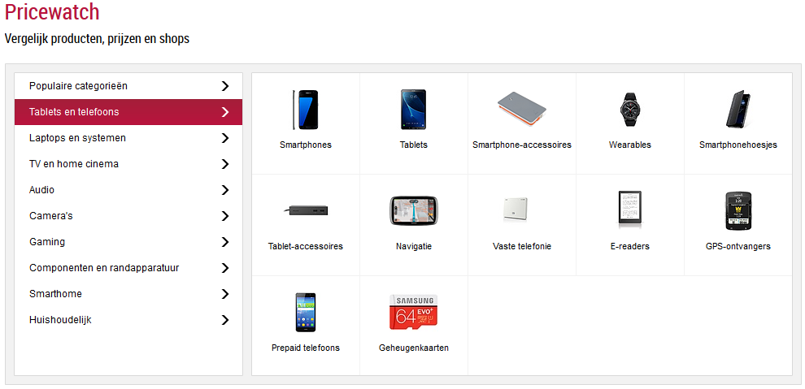
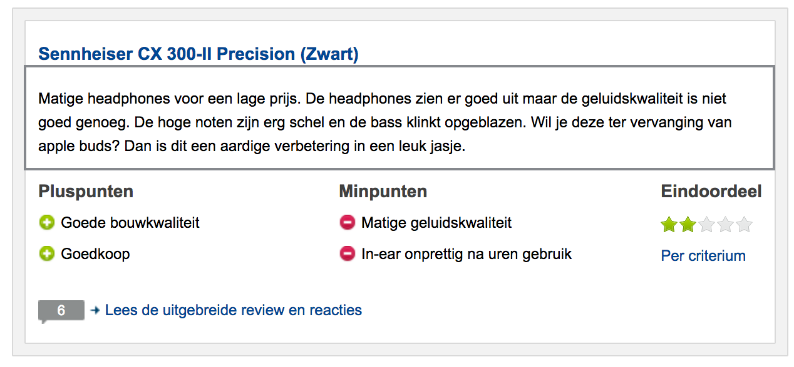

# Project
The goal of this project is to assess your skills in different topics that can benefit you when performing an analysis related to NLP.

## Sentiment Analysis
Create a sentiment analysis application in your environment of choice.
The goal of this sentiment analysis is to predict the sentiment of an unseen sentence (positive - negative) 
To achieve this, you have to create your own corpus which contains user reviews by **Tweakers**.

### part 1: webscraping - Corpus
The goal of a corpus is to have a fairly reliable document which contains reviews and their respective scores.
We assume that *low*-scored reviews contain more *negative* words than *highly*-scored reviews (and vice versa).
Therefore the first task is to scrape positive and negative reviews from **Tweakers.net**

 - Positive = 4 & 5 stars
 - Negative = 1 & 2 stars
 - Ignore 3 star reviews
 
#### Start - [https://tweakers.net/](https://tweakers.net/pricewatch/) 

On the webpage of Tweakers (pricewatch), you see 9 Categories and these can contain subcategories (Componenten en randapparatuur).

Your task is to scrape **random** reviews over **all** these subcategories, until you have a decent amount of reviews.

### Restrictions

 - Not every product contains reviews.
 - Not every product will contain Positive or Negative reviews.
 - Ignore the reviews with 3 star ratings.
 - Ignore the pros and cons of the product.
 - Only use the text from the user review (emphasized by the rectangle).
 - We only want to use reviews with **more than** 19 words.

 
#### Scraper goals: 
- [ ] Crawl from the main page to all the product review pages
- [ ] Scrape 1 2 4 5-star reviews*

#### Questions:
- [ ] What is the effect of using different / random categories and subjects?

### part 2: Sentiment Analysis
Given your selfmade corpus, create a small sentiment analysis application which can analyse/classify unseen sentences and reviews.

## IBM Watson Explorer trivia

 - 

## Chatbot
Create a chatbot which can answer FAQ questions from **TripAdvisor**.

### part 1: webscraping
Create a webscraper which scrapes all the *main* questions and answers from TripAdvisor. (Dutch only)

#### Start - [https://www.tripadvisorsupport.com/hc/nl](https://www.tripadvisorsupport.com/hc/nl)
On the webpage of TripAdvisor, you see 4 different categories : 
- **Richtlijnen**
- **Websitefuncties**
- **Community**
- **Technische ondersteuning**

Each categorie contains multiple subcategories e.g. : 
- **Richtlijnen/Beoordelingen schrijven**
- **Richtlijnen/Vermeldingsrichtlijnen**
- **...**

Each subcategory contains multiple questions : 
- **Onze richtlijnen voor beoordelingen van vakantiewoningen.**
- **Wat zijn beoordelingen van luchtvaartmaatschappijen?**
- **...**

#### Scraper goals: 
- [ ] Crawl from the main question page to all the underlying answers. (2 or 3 hops)
- [ ] Scrape all the underlying questions.
- [ ] Scrape the first paragraph of each answer.

### part 2: Chatbot

#### Goals

- [ ] Create a chatbot which answers the questions of an user.
- [ ] Can it handle small type-errors / Fuzzy mapping?
- [ ] Does it return **"Ik heb je niet goed begrepen"**, when the chatbot isn't sure about the answer?

### part 3: Questions
##### (not required to implement)
- [ ] How would you teach the bot new questions and what can go wrong?
- [ ] How would you optimize your bot?
- [ ] If you had more time and no restrictions, how would you handle the case?

##### or
- [ ] Own creative idea

Do not hesitate to ask for help if you're stuck, after all we might become colleagues :)

